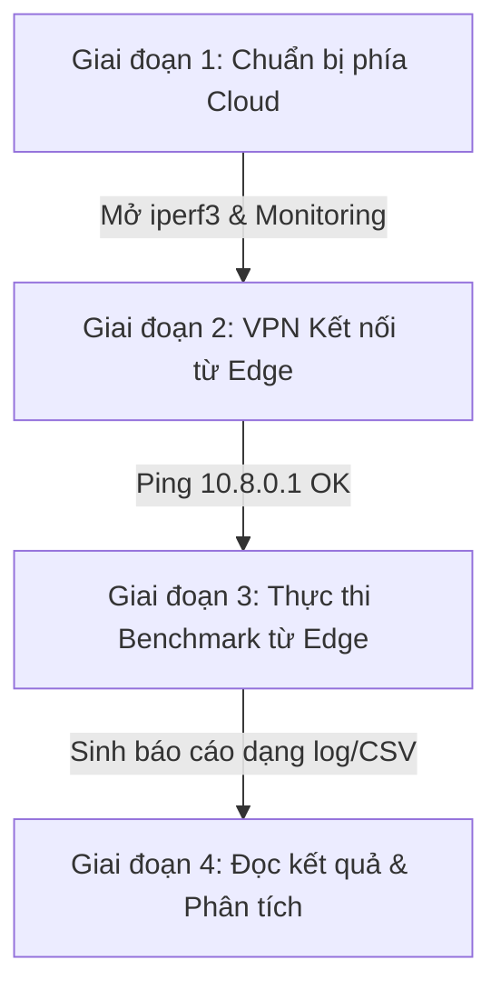

# Hướng dẫn Chạy Benchmark trên Cloud Gateway (AWS EC2)

Tài liệu này cung cấp hướng dẫn từng bước để chuẩn bị hạ tầng Cloud và thực hiện toàn bộ suite benchmark từ thiết bị Edge của bạn đến AWS EC2 Gateway đã được deploy bằng Terraform.

> [!NOTE]
> Địa chỉ IP public của Cloud EC2 được phát hiện tự động từ file trạng thái Terraform của bạn là: **`52.74.220.78`**.
> Địa chỉ IP overlay WireGuard của Cloud Gateway mặc định là: **`10.8.0.1`**.

---

## Quy trình Thực hiện Tổng quan

Việc chạy benchmark bao gồm 3 giai đoạn chính:



---

## Giai đoạn 1: Chuẩn bị phía Cloud (AWS EC2)

Để đo lường hiệu năng mạng, băng thông và dịch vụ giám sát, bạn cần chạy các dịch vụ làm server-side trên EC2 instance trước.

### 1.1. SSH vào Cloud Gateway
Sử dụng key SSH (`wg-key-pair`) để kết nối tới EC2:
```bash
ssh -i ~/.ssh/wg-key-pair.pem ec2-user@52.74.220.78
```

### 1.2. Khởi chạy `iperf3` server ở chế độ daemon
Bộ test băng thông (Suite 02 và 04) sẽ truyền dữ liệu TCP/UDP trực tiếp tới cổng `5201` của EC2. Khởi động iperf3 chạy ngầm:
```bash
iperf3 -s -D
```
*Kiểm tra cổng đã mở thành công:*
```bash
ss -lntp | grep 5201
```

### 1.3. Khởi chạy Stack Giám sát (Monitoring Stack)
Để Suite 03 (Services) có thể kiểm thử Prometheus, Loki và Grafana, hãy kích hoạt Docker Compose giám sát:
```bash
# Di chuyển tới thư mục giám sát trên EC2
cd ~/wireguard-edge-cloud-5g/cloud/monitoring

# Khởi chạy stack docker-compose
sudo ./setup-monitoring.sh
# Hoặc chạy trực tiếp qua docker compose:
# sudo -E docker compose --env-file ../../.env up -d --force-recreate
```
*Xác nhận các service đều khỏe mạnh:*
```bash
curl http://127.0.0.1:9090/-/healthy  # Prometheus
curl http://127.0.0.1:3100/ready      # Loki
curl http://127.0.0.1:3000/api/health # Grafana
```

---

## Giai đoạn 2: Thiết lập kết nối WireGuard từ Edge Node

Benchmark cần được đo qua kênh VPN mã hóa để so sánh độ trễ và băng thông hao hụt (overhead).

1. Đảm bảo dịch vụ WireGuard trên Edge Node đã khởi chạy:
   ```bash
   sudo systemctl start wg-quick@wg0
   ```
2. Kiểm tra trạng thái đường truyền:
   ```bash
   sudo wg show
   ```
3. Kiểm tra thông suốt IP overlay đến Cloud Gateway:
   ```bash
   ping -c 5 10.8.0.1
   ```
   > [!IMPORTANT]
   > Nếu không ping được `10.8.0.1`, benchmark sẽ thất bại ngay lập tức ở Suite 01. Hãy kiểm tra lại security group trên AWS hoặc cấu hình endpoint trong file `wg0.conf` của Edge phải trỏ đúng về `52.74.220.78:64203`.

---

## Giai đoạn 3: Thực thi Benchmark từ Edge Node

Sau khi kết nối hoàn tất, hãy quay lại thiết bị **Edge Node** để chạy benchmark suite.

### 3.1. Chạy toàn bộ các test suite (Không phá hủy)
Chạy tất cả kiểm thử đo đạc độ trễ, băng thông và service (không ngắt kết nối mạng):
```bash
cd /home/hiengyen/CODE/wireguard-edge-cloud-5g
./benchmark/run_all.sh
```

### 3.2. Chạy toàn bộ test suite kèm theo các bài test tải phá hủy (Destructive Tests)
Các bài test này sẽ đo thời gian phục hồi kết nối 5G (WWAN Reconnect) và khả năng chuyển mạch dự phòng (Failover). **Yêu cầu quyền root (sudo) và sẽ gây mất mạng tạm thời**:
```bash
sudo ./benchmark/run_all.sh --allow-destructive
```

### 3.3. Chạy riêng từng bộ kiểm thử cụ thể
Nếu bạn chỉ muốn kiểm tra tốc độ mạng hoặc dịch vụ:
```bash
# Chỉ chạy Suite 01 (Connectivity) và Suite 02 (Bandwidth)
./benchmark/run_all.sh --suite 01,02

# Chỉ chạy Suite 03 (Services)
./benchmark/run_all.sh --suite 03
```

### 3.4. Ghi đè tham số trực tiếp (Inline Environment Overrides)
Bạn có thể thay đổi các ngưỡng chấp nhận hoặc thời gian test trực tiếp trên command line mà không cần sửa code:
```bash
# Tăng thời gian test iperf lên 30 giây, số luồng song song lên 8
IPERF3_DURATION=30 IPERF3_PARALLEL=8 ./benchmark/run_all.sh --suite 02

# Đo lường độ hao hụt (overhead) của Wireguard bằng cách truyền tải trực tiếp qua IP Public
CLOUD_PUBLIC_IP=52.74.220.78 ./benchmark/run_all.sh --suite 02
```

---

## Giai đoạn 4: Đọc Báo cáo & Phân tích Kết quả

### 4.1. Console Output mẫu
Khi chạy, bạn sẽ thấy kết quả hiển thị trực quan:
```text
[14:30:21] Running: 01-A Ping Latency
  ✔ PASS  WG-overlay → cloud-gateway: RTT=42ms loss=0% jitter=3ms
  ✔ PASS  Internet RTT → 8.8.8.8: RTT=28ms loss=0%
  ✔ 01-A Ping Latency: PASS (2P 0W in 4s)
```

### 4.2. File Báo cáo chi tiết (Reports)
Tất cả báo cáo thô, file JSON, và file đo lường CSV đều được tự động lưu vào thư mục `benchmark/reports/` (đã được cấu hình trong `.gitignore`):
```text
benchmark/reports/
├── run_all_20260519_143021.log        # Báo cáo tổng hợp quá trình chạy
├── 01-ping-latency_143022.txt         # Chi tiết độ trễ RTT
├── iperf3_tcp_20260519_143045.txt     # Kết quả chi tiết iperf3 dạng JSON
├── sustained_20260519_143200.csv      # Báo cáo băng thông duy trì theo từng giây
└── monitoring_load_20260519_143310.csv # Độ trễ truy vấn các service (Prometheus, Loki)
```

> [!TIP]
> Bạn có thể import file `sustained_*.csv` vào Excel, Google Sheets hoặc hiển thị trực tiếp lên dashboard Grafana để vẽ biểu đồ so sánh độ ổn định băng thông 5G theo thời gian.
