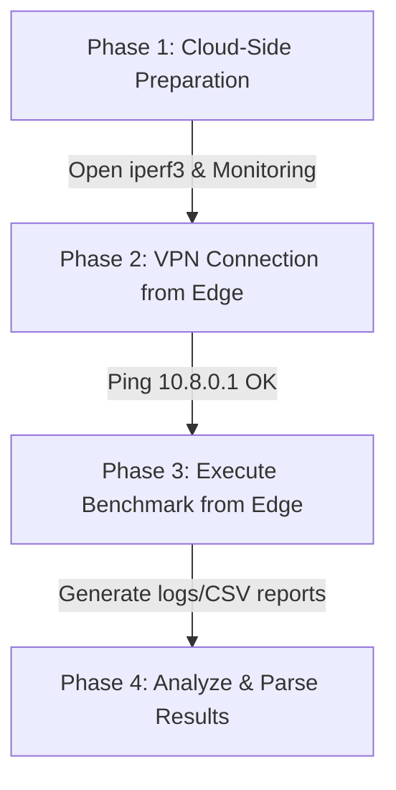
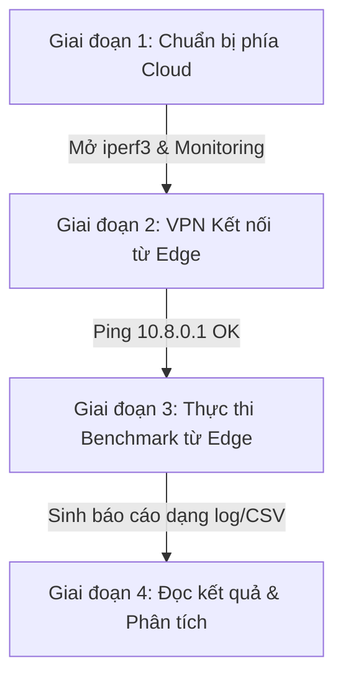

# Cloud Gateway Benchmark Guide | Hướng Dẫn Chạy Benchmark Trên Cloud Gateway (AWS EC2)

🇬🇧 [English](#-english) | 🇻🇳 [Tiếng Việt](#-tiếng-việt)

---

## 🇬🇧 English

This document provides a step-by-step guide to preparing your cloud infrastructure and executing the complete benchmark suite from your Edge device to the AWS EC2 Gateway provisioned via Terraform.

> [!NOTE]
> The public IP of the Cloud EC2 instance auto-detected from your Terraform state is: **`52.74.220.78`**.
> The default WireGuard overlay IP of the Cloud Gateway is: **`10.8.0.1`**.

---

## E2E Benchmark Workflow

The benchmarking workflow consists of three main phases:


```mermaid
graph TD
    A[Phase 1: Cloud-Side Preparation] -->|Open iperf3 & Monitoring| B[Phase 2: VPN Connection from Edge]
    B -->|Ping 10.8.0.1 OK| C[Phase 3: Execute Benchmark from Edge]
    C -->|Generate logs/CSV reports| D[Phase 4: Analyze & Parse Results]
```

---

## Phase 1: Cloud-Side Preparation (AWS EC2)

To measure network performance, bandwidth, and observability health, you need to run server-side listener services on the EC2 instance first.

### 1.1. SSH into the Cloud Gateway
Use your SSH key pair (`wg-key-pair`) to connect to the EC2 instance:
```bash
ssh -i ~/.ssh/wg-key-pair.pem ec2-user@52.74.220.78
```

### 1.2. Launch `iperf3` Server in Daemon Mode
The bandwidth suites (Suite 02 and 04) transfer TCP/UDP traffic directly to EC2 port `5201`. Start the iperf3 server in background daemon mode:
```bash
iperf3 -s -D
```
*Verify that the port is listening successfully:*
```bash
ss -lntp | grep 5201
```

### 1.3. Launch the Monitoring Stack
To allow Suite 03 (Services) to test Prometheus, Loki, and Grafana, spin up the Docker Compose monitoring stack:
```bash
# Navigate to the monitoring directory on EC2
cd ~/wireguard-edge-cloud-5g/cloud/monitoring

# Start the stack using the wrapper
sudo -E bash setup-monitoring.sh
# Or run directly via docker compose:
# sudo -E docker compose --env-file ../../.env.cloud up -d --force-recreate
```
*Confirm all services are healthy:*
```bash
curl http://127.0.0.1:9090/-/healthy  # Prometheus
curl http://127.0.0.1:3100/ready      # Loki
curl http://127.0.0.1:3000/api/health # Grafana
```

---

## Phase 2: Establish WireGuard Connection from the Edge Node

Benchmarks must be conducted over the encrypted VPN tunnel to capture latency overhead and bandwidth degradation.

1. Ensure the WireGuard interface is up on the Edge Node:
   ```bash
   sudo systemctl start wg-quick@wg0
   ```
2. Verify tunnel status:
   ```bash
   sudo wg show
   ```
3. Test end-to-end overlay connectivity to the Cloud Gateway:
   ```bash
   ping -c 5 10.8.0.1
   ```
   > [!IMPORTANT]
   > If you cannot ping `10.8.0.1`, the benchmark suite will fail immediately at Suite 01. Double-check your AWS security group rules or ensure the endpoint in your Edge `wg0.conf` points correctly to `52.74.220.78:64203`.

---

## Phase 3: Execute Benchmark from the Edge Node

Once connected, return to the **Edge Node** shell to run the benchmark suite.

### 3.1. Run All Non-Destructive Suites
Measure latency, TCP/UDP throughput, and monitoring service health without disrupting the connection:
```bash
cd /home/hiengyen/CODE/wireguard-edge-cloud-5g
bash benchmark/run_all.sh
```

### 3.2. Run All Suites including Destructive Scenarios
These scenarios measure 5G cellular reconnection latency (WWAN Reconnect) and failover recovery windows. **Requires root (sudo) and will temporarily disrupt networking**:
```bash
sudo -E bash benchmark/run_all.sh --allow-destructive
```

### 3.3. Run Specific Test Suites
If you want to target only throughput or service performance:
```bash
# Run only Suite 01 (Connectivity) and Suite 02 (Bandwidth)
bash benchmark/run_all.sh --suite 01,02

# Run only Suite 03 (Services)
bash benchmark/run_all.sh --suite 03
```

### 3.4. Inline Environment Overrides
You can adjust benchmark thresholds and testing durations on the command line without editing script source code:
```bash
# Run iperf for 30 seconds with 8 parallel streams
IPERF3_DURATION=30 IPERF3_PARALLEL=8 bash benchmark/run_all.sh --suite 02

# Measure the WireGuard encryption overhead by testing directly against the public IP
CLOUD_PUBLIC_IP=52.74.220.78 bash benchmark/run_all.sh --suite 02
```

---

## Phase 4: Analyze & Parse Results

### 4.1. Sample Console Output
During execution, results are displayed interactively in the terminal:
```text
[14:30:21] Running: 01-A Ping Latency
  ✔ PASS  WG-overlay → cloud-gateway: RTT=42ms loss=0% jitter=3ms
  ✔ PASS  Internet RTT → 8.8.8.8: RTT=28ms loss=0%
  ✔ 01-A Ping Latency: PASS (2P 0W in 4s)
```

### 4.2. Detailed Reports
All raw text reports, structured JSON outputs, and measurement CSVs are saved in `benchmark/reports/` (this directory is ignored by Git):
```text
benchmark/reports/
├── run_all_20260519_143021.log        # Master log file of the entire run
├── 01-ping-latency_143022.txt         # Detailed ping RTT logs
├── iperf3_tcp_20260519_143045.txt     # Raw JSON output from iperf3
├── sustained_20260519_143200.csv      # Second-by-second throughput stats
└── monitoring_load_20260519_143310.csv # Scraper query latency (Prometheus, Loki)
```

> [!TIP]
> You can import the second-by-second `sustained_*.csv` file into Excel, Google Sheets, or directly visualize it on your Grafana dashboard to chart the stability of your 5G network under load over time.

---

## 🇻🇳 Tiếng Việt

Tài liệu này cung cấp hướng dẫn từng bước để chuẩn bị hạ tầng Cloud và thực hiện toàn bộ suite benchmark từ thiết bị Edge của bạn đến AWS EC2 Gateway đã được deploy bằng Terraform.

> [!NOTE]
> Địa chỉ IP public của Cloud EC2 được phát hiện tự động từ file trạng thái Terraform của bạn là: **`52.74.220.78`**.
> Địa chỉ IP overlay WireGuard của Cloud Gateway mặc định là: **`10.8.0.1`**.

---

## Quy trình Thực hiện Tổng quan

Việc chạy benchmark bao gồm 3 giai đoạn chính:


```mermaid
graph TD
    A[Giai đoạn 1: Chuẩn bị phía Cloud] -->|Mở iperf3 & Monitoring| B[Giai đoạn 2: VPN Kết nối từ Edge]
    B -->|Ping 10.8.0.1 OK| C[Giai đoạn 3: Thực thi Benchmark từ Edge]
    C -->|Sinh báo cáo dạng log/CSV| D[Giai đoạn 4: Đọc kết quả & Phân tích]
```

---

## Giai đoạn 1: Chuẩn bị phía Cloud (AWS EC2)

Để đo lường hiệu năng mạng, băng thông và dịch vụ giám sát, bạn cần chạy các dịch vụ làm server-side trên EC2 instance trước.

### 1.1. SSH vào Cloud Gateway
Sử dụng key SSH (`wg-key-pair`) để kết nối tới EC2:
```bash
ssh -i ~/.ssh/wg-key-pair.pem ec2-user@52.74.220.78
```

### 1.2. Khởi chạy `iperf3` server ở chế độ daemon
Bộ test băng thông (Suite 02 và 04) sẽ truyền dữ liệu TCP/UDP trực tiếp tới cổng `5201` của EC2. Khởi động iperf3 chạy ngầm:
```bash
iperf3 -s -D
```
*Kiểm tra cổng đã mở thành công:*
```bash
ss -lntp | grep 5201
```

### 1.3. Khởi chạy Stack Giám sát (Monitoring Stack)
Để Suite 03 (Services) có thể kiểm thử Prometheus, Loki và Grafana, hãy kích hoạt Docker Compose giám sát:
```bash
# Di chuyển tới thư mục giám sát trên EC2
cd ~/wireguard-edge-cloud-5g/cloud/monitoring

# Khởi chạy stack docker-compose
sudo -E bash setup-monitoring.sh
# Hoặc chạy trực tiếp qua docker compose:
# sudo -E docker compose --env-file ../../.env.cloud up -d --force-recreate
```
*Xác nhận các service đều khỏe mạnh:*
```bash
curl http://127.0.0.1:9090/-/healthy  # Prometheus
curl http://127.0.0.1:3100/ready      # Loki
curl http://127.0.0.1:3000/api/health # Grafana
```

---

## Giai đoạn 2: Thiết lập kết nối WireGuard từ Edge Node

Benchmark cần được đo qua kênh VPN mã hóa để so sánh độ trễ và băng thông hao hụt (overhead).

1. Đảm bảo dịch vụ WireGuard trên Edge Node đã khởi chạy:
   ```bash
   sudo systemctl start wg-quick@wg0
   ```
2. Kiểm tra trạng thái đường truyền:
   ```bash
   sudo wg show
   ```
3. Kiểm tra thông suốt IP overlay đến Cloud Gateway:
   ```bash
   ping -c 5 10.8.0.1
   ```
   > [!IMPORTANT]
   > Nếu không ping được `10.8.0.1`, benchmark sẽ thất bại ngay lập tức ở Suite 01. Hãy kiểm tra lại security group trên AWS hoặc cấu hình endpoint trong file `wg0.conf` của Edge phải trỏ đúng về `52.74.220.78:64203`.

---

## Giai đoạn 3: Thực thi Benchmark từ Edge Node

Sau khi kết nối hoàn tất, hãy quay lại thiết bị **Edge Node** để chạy benchmark suite.

### 3.1. Chạy toàn bộ các test suite (Không phá hủy)
Chạy tất cả kiểm thử đo đạc độ trễ, băng thông và service (không ngắt kết nối mạng):
```bash
cd /home/hiengyen/CODE/wireguard-edge-cloud-5g
bash benchmark/run_all.sh
```

### 3.2. Chạy toàn bộ test suite kèm theo các bài test tải phá hủy (Destructive Tests)
Các bài test này sẽ đo thời gian phục hồi kết nối 5G (WWAN Reconnect) và khả năng chuyển mạch dự phòng (Failover). **Yêu cầu quyền root (sudo) và sẽ gây mất mạng tạm thời**:
```bash
sudo -E bash benchmark/run_all.sh --allow-destructive
```

### 3.3. Chạy riêng từng bộ kiểm thử cụ thể
Nếu bạn chỉ muốn kiểm tra tốc độ mạng hoặc dịch vụ:
```bash
# Chỉ chạy Suite 01 (Connectivity) và Suite 02 (Bandwidth)
bash benchmark/run_all.sh --suite 01,02

# Chỉ chạy Suite 03 (Services)
bash benchmark/run_all.sh --suite 03
```

### 3.4. Ghi đè tham số trực tiếp (Inline Environment Overrides)
Bạn có thể thay đổi các ngưỡng chấp nhận hoặc thời gian test trực tiếp trên command line mà không cần sửa code:
```bash
# Tăng thời gian test iperf lên 30 giây, số luồng song song lên 8
IPERF3_DURATION=30 IPERF3_PARALLEL=8 bash benchmark/run_all.sh --suite 02

# Đo lường độ hao hụt (overhead) của Wireguard bằng cách truyền tải trực tiếp qua IP Public
CLOUD_PUBLIC_IP=52.74.220.78 bash benchmark/run_all.sh --suite 02
```

---

## Giai đoạn 4: Đọc Báo cáo & Phân tích Kết quả

### 4.1. Console Output mẫu
Khi chạy, bạn sẽ thấy kết quả hiển thị trực quan:
```text
[14:30:21] Running: 01-A Ping Latency
  ✔ PASS  WG-overlay → cloud-gateway: RTT=42ms loss=0% jitter=3ms
  ✔ PASS  Internet RTT → 8.8.8.8: RTT=28ms loss=0%
  ✔ 01-A Ping Latency: PASS (2P 0W in 4s)
```

### 4.2. File Báo cáo chi tiết (Reports)
Tất cả báo cáo thô, file JSON, và file đo lường CSV đều được tự động lưu vào thư mục `benchmark/reports/` (đã được cấu hình trong `.gitignore`):
```text
benchmark/reports/
├── run_all_20260519_143021.log        # Báo cáo tổng hợp quá trình chạy
├── 01-ping-latency_143022.txt         # Chi tiết độ trễ RTT
├── iperf3_tcp_20260519_143045.txt     # Kết quả chi tiết iperf3 dạng JSON
├── sustained_20260519_143200.csv      # Báo cáo băng thông duy trì theo từng giây
└── monitoring_load_20260519_143310.csv # Độ trễ truy vấn các service (Prometheus, Loki)
```

> [!TIP]
> Bạn có thể import file `sustained_*.csv` vào Excel, Google Sheets hoặc hiển thị trực tiếp lên dashboard Grafana để vẽ biểu đồ so sánh độ ổn định băng thông 5G theo thời gian.
