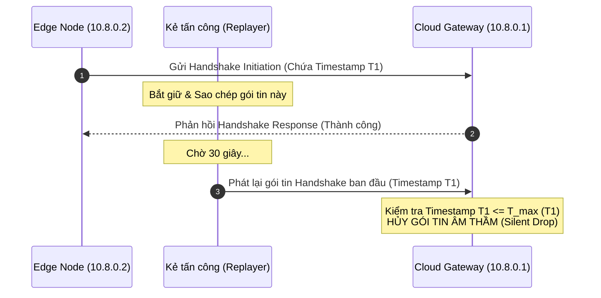

# Hướng dẫn Kịch bản Kiểm thử Bảo mật VPN
## Xác minh khả năng chống Eavesdropping, MITM và Replay Attacks

Tài liệu này cung cấp các kịch bản kiểm thử thực tế và an toàn nhằm chứng minh các tính chất bảo mật cốt lõi của giải pháp WireGuard VPN được triển khai trong dự án `wireguard-edge-cloud-5g`. 

Hệ thống VPN trong dự án sử dụng mô hình **Client-to-Site (Edge-to-Cloud)** với dải mạng overlay `10.8.0.0/24` (Cloud Gateway: `10.8.0.1`, Edge Clients: `10.8.0.2/32`, `10.8.0.3/32`,...). Do WireGuard được xây dựng trên nền tảng mật mã hiện đại (**Noise Protocol Framework**, **Curve25519**, **ChaCha20**, **Poly1305**, **BLAKE2s**), nó mặc định có khả năng chống lại các kiểu tấn công mạng phổ biến mà không cần cấu hình phức tạp.

Dưới đây là các kịch bản thực tế để đội ngũ kỹ thuật hoặc kiểm toán bảo mật (security auditor) có thể thực hiện nhằm xác minh các cam kết bảo mật này.

---

```mermaid
graph TD
    subgraph Edge Node (10.8.0.2)
        A[Ứng dụng / Alloy] -->|Dữ liệu rõ / Cleartext| B(Giao diện wg0)
    end
    subgraph Underlay Network (Môi trường mạng vật lý / Internet)
        B -->|Mã hóa ChaCha20-Poly1305| C{Kênh truyền dẫn mạng}
        C -->|Gói tin mã hóa port 51820| D[Kẻ tấn công / Sniffer]
    end
    subgraph Cloud Gateway (10.8.0.1)
        C -->|Giải mã & Kiểm tra MAC| E(Giao diện wg0)
        E -->|Dữ liệu rõ / Cleartext| F[Prometheus / Loki / Grafana]
    end
    style D fill:#ffcccc,stroke:#ff3333,stroke-width:2px;
```

---

## 1. Kịch bản 1: Chứng minh Khả năng chống Nghe lén (Eavesdropping / Sniffing)

### Mục tiêu
Chứng minh rằng kẻ tấn công nằm trên đường truyền vật lý (ví dụ: cùng mạng Wi-Fi, tại ISP, hoặc chiếm quyền kiểm soát router trung gian) chỉ có thể thấy các gói tin UDP mã hóa và không thể đọc được nội dung dữ liệu thực tế di chuyển trong kênh truyền VPN.

### Các bước thực hiện

1. **Chuẩn bị môi trường:** 
   - Đảm bảo kết nối VPN giữa Edge Client (`10.8.0.2`) và Cloud Gateway (`10.8.0.1`) đang hoạt động ổn định.
   - Xác định giao diện mạng vật lý (underlay interface, ví dụ: `eth0`, `wlan0` hoặc giao diện 5G `wwan0`) và giao diện ảo VPN (`wg0`).

2. **Khởi chạy Sniffer trên giao diện mạng vật lý:**
   Trên Edge Client hoặc một node trung gian, chạy công cụ capture gói tin `tcpdump` để lắng nghe trên cổng vật lý hướng ra ngoài Internet:
   ```bash
   # Thay thế eth0 bằng giao diện mạng vật lý thực tế của bạn
   sudo tcpdump -i eth0 udp port 51820 -XX -c 20 -w /tmp/underlay_traffic.pcap
   ```
   *(Lệnh trên sẽ bắt 20 gói tin đi/đến cổng WireGuard `51820` và lưu thành file pcap).*

3. **Tạo lưu lượng truy cập (Traffic) trong VPN:**
   Trong khi `tcpdump` đang chạy, mở một terminal khác trên Edge Node và gửi dữ liệu nhạy cảm qua mạng overlay (ví dụ: ping hoặc gửi log hệ thống tới Loki):
   ```bash
   ping -c 5 10.8.0.1
   # Hoặc kiểm tra luồng gửi log của Alloy
   curl -H "Content-Type: application/json" -XPOST -d '{"streams": [{"stream": {"job": "test"}, "values": [["'"$(date +%s%N)"'", "Day la thong tin cuc ky nhay sam!"]]}]}' http://10.8.0.1:3100/loki/api/v1/push
   ```

4. **Phân tích kết quả capture:**
   Đọc file pcap đã capture để kiểm tra nội dung gói tin:
   ```bash
   tcpdump -r /tmp/underlay_traffic.pcap -XX
   ```

### Kết quả & Chứng minh an toàn
* **Không lộ cấu trúc IP mạng nội bộ:** Địa chỉ nguồn và đích hiển thị trên gói tin chỉ là IP vật lý công cộng của Edge Node và Cloud Gateway. Địa chỉ IP overlay (`10.8.0.1` hay `10.8.0.2`) hoàn toàn bị ẩn đi.
* **Mã hóa toàn vẹn:** Dữ liệu hiển thị ở dạng hex và ASCII chỉ là các chuỗi byte ngẫu nhiên (high entropy bytes). Bạn sẽ không thể tìm thấy bất kỳ chuỗi văn bản rõ nào như `"Day la thong tin cuc ky nhay sam!"` hay cấu trúc giao thức ứng dụng (HTTP, Loki, syslog).
* **Kết luận:** Tấn công nghe lén thất bại hoàn toàn vì toàn bộ gói tin đi qua mạng vật lý đã được mã hóa đối xứng bằng thuật toán **ChaCha20**.

---

## 2. Kịch bản 2: Chứng minh Khả năng chống Tấn công giả mạo & Xen giữa (MITM)

Tấn công MITM đối với VPN thường chia làm hai hướng: **(A) Giả mạo thực thể (Impersonation)** và **(B) Thay đổi dữ liệu trên đường truyền (Data Tampering)**.

### Hướng A: Giả mạo Cloud Gateway (Server Impersonation)

#### Cách thức hoạt động của WireGuard
WireGuard sử dụng cơ chế xác thực dựa trên **Khóa công khai tĩnh (Static Public Key)** được cấu hình trước (Pre-shared). Client chỉ chấp nhận bắt tay (handshake) với Server có Private Key tương ứng với Public Key được chỉ định trong file cấu hình `/etc/wireguard/wg0.conf`.

#### Kịch bản kiểm thử giả định
Giả sử kẻ tấn công thực hiện DNS Spoofing hoặc ARP Spoofing để chuyển hướng lưu lượng từ Edge Client tới một máy chủ giả mạo do kẻ tấn công kiểm soát (Rogue Gateway).

#### Các bước thực hiện
1. **Thiết lập cấu hình lỗi (Mô phỏng bắt tay với Server giả mạo):**
   Trên Edge Client, chúng ta thử sửa đổi Public Key của Server trong file cấu hình sang một khóa không hợp lệ (mô phỏng việc trỏ đến một Server không có Private Key khớp với cấu hình ban đầu).
   ```bash
   # Sao lưu cấu hình cũ
   sudo cp /etc/wireguard/wg0.conf /etc/wireguard/wg0.conf.bak
   
   # Sửa đổi cấu hình, thay đổi khóa public_key của Server thành một chuỗi ngẫu nhiên hợp lệ
   # Ví dụ thay thế dòng PublicKey = <Server_Real_Public_Key> bằng một khóa giả
   ```

2. **Khởi động lại giao diện VPN:**
   ```bash
   sudo wg-quick down wg0
   sudo wg-quick up wg0
   ```

3. **Kiểm tra trạng thái kết nối:**
   ```bash
   sudo wg show wg0
   ping -c 3 10.8.0.1
   ```

#### Kết quả & Chứng minh an toàn
* Giao diện `wg0` không thể thiết lập kết nối thành công. Lệnh `sudo wg show` sẽ không hiển thị trường `latest handshake` hoặc thời gian handshake sẽ tăng liên tục mà không có phản hồi thành công.
* Toàn bộ gói tin gửi đi từ Client được mã hóa bằng khóa công khai sai sẽ bị loại bỏ âm thầm bởi Server thực tế, và ngược lại, Client cũng từ chối mọi phản hồi từ Server không có Private Key tương ứng.
* **Kết luận:** Kẻ tấn công MITM dù có định tuyến được traffic về phía máy chủ của họ cũng không thể giải mã được gói tin bắt tay ban đầu và không thể thiết lập kênh truyền.

---

### Hướng B: Giả mạo/Thay đổi dữ liệu trên đường truyền (Data Tampering)

#### Cách thức hoạt động của WireGuard
Mỗi gói tin vận chuyển trong đường hầm WireGuard đều được đóng gói bằng AEAD (Authenticated Encryption with Associated Data) sử dụng **ChaCha20-Poly1305**. Poly1305 tạo ra một thẻ xác thực (MAC tag) 16-byte cho mỗi gói tin.

#### Kịch bản kiểm thử giả định
Kẻ tấn công xen giữa bắt giữ gói tin trên đường truyền vật lý, thay đổi 1 hoặc một vài bit dữ liệu (ví dụ: thay đổi mã lệnh hoặc tham số hệ thống gửi về API), sau đó chuyển tiếp gói tin đã sửa đổi tới đích.

#### Các bước thực hiện (Phân tích lý thuyết & Nhật ký hệ thống)
Do cơ chế mã hóa AEAD được xử lý trực tiếp ở tầng Kernel của hệ điều hành:
1. Khi Cloud Gateway nhận được một gói tin VPN bị thay đổi nội dung, module Kernel WireGuard sẽ thực hiện tính toán lại thẻ Poly1305 bằng khóa phiên đối xứng (symmetric session key).
2. Do dữ liệu bị thay đổi, thẻ Poly1305 được tính toán lại chắc chắn sẽ **không trùng khớp** với thẻ đính kèm trong gói tin.
3. WireGuard sẽ **ngay lập tức hủy gói tin (silent drop)** mà không gửi lại bất kỳ phản hồi lỗi nào cho kẻ tấn công (để tránh rò rỉ thông tin qua kênh phụ - side-channel leaks).

#### Cách chứng minh qua công cụ giám sát
Chúng ta có thể bật debug log của WireGuard trên Cloud Gateway để quan sát phản ứng của hệ thống khi có gói tin lỗi/bị can thiệp:
```bash
# Bật dynamic debug log cho module wireguard (yêu cầu quyền root)
echo "module wireguard +p" | sudo tee /sys/kernel/debug/dynamic_debug/control

# Theo dõi log hệ thống trong thời gian thực
sudo dmesg -wT | grep wireguard
```
Khi có gói tin bị giả mạo hoặc sai định dạng MAC gửi tới cổng `51820`, hệ thống sẽ ghi nhận các thông báo dạng:
`wireguard: wg0: Packet has invalid mac...` hoặc `Packet has invalid tag...` và tự động hủy bỏ, giữ an toàn tuyệt đối cho ứng dụng phía sau.

---

## 3. Kịch bản 3: Chứng minh Khả năng chống Tấn công Phát lại (Replay Attack)

### Mục tiêu
Chứng minh rằng kẻ tấn công bắt giữ một gói tin hợp lệ trên đường truyền (ví dụ: gói tin bắt tay khởi tạo kết nối Handshake Initiation, hoặc gói tin dữ liệu chứa hành vi kích hoạt cảnh báo) và gửi lại gói tin đó sau một khoảng thời gian sẽ bị WireGuard từ chối hoàn toàn, không thể gây ra hành vi trùng lặp hoặc giả mạo phiên.



### Cách thức hoạt động chống Replay của WireGuard

1. **Đối với gói tin Bắt tay (Handshake Initiation):**
   * WireGuard sử dụng cấu trúc thời gian **TAI64N** (độ chính xác nano giây) được mã hóa trong gói tin bắt tay.
   * Server luôn lưu trữ timestamp lớn nhất nhận được từ mỗi Peer (`T_max`).
   * Nếu Server nhận được gói tin bắt tay mới có timestamp `T_new` thỏa mãn `T_new <= T_max`, Server sẽ **loại bỏ gói tin ngay lập tức**.
2. **Đối với gói tin Dữ liệu (Transport Data):**
   * Mỗi gói tin dữ liệu chứa một số thứ tự tăng dần liên tục (64-bit sequence counter).
   * Đầu nhận sử dụng một **cửa sổ trượt (sliding window)** kích thước 2048 gói tin để theo dõi các số thứ tự đã nhận.
   * Mọi gói tin có số thứ tự bị trùng lặp hoặc tụt lại quá sâu phía sau cửa sổ trượt sẽ bị loại bỏ không điều kiện.

### Kịch bản thực hành xác minh an toàn

1. **Chuẩn bị công cụ Capture & Replay:**
   Chúng ta sẽ sử dụng `tcpdump` để bắt gói tin bắt tay từ Edge Client và công cụ `tcpreplay` hoặc `netcat` để phát lại gói tin đó trên giao diện vật lý.

2. **Bắt gói tin khởi tạo kết nối (Handshake):**
   Trên Edge Client, ngắt kết nối VPN và chuẩn bị bắt gói tin khi khởi động lại:
   ```bash
   sudo wg-quick down wg0
   
   # Bắt đầu nghe và lọc riêng gói tin Handshake Initiation (thường là gói tin UDP đầu tiên gửi đi)
   sudo tcpdump -i eth0 udp port 51820 -c 1 -w /tmp/handshake_init.pcap
   ```
   Trong một terminal khác, bật lại VPN để kích hoạt quá trình bắt tay:
   ```bash
   sudo wg-quick up wg0
   ```
   File `/tmp/handshake_init.pcap` hiện đã lưu trữ đúng 1 gói tin Handshake Initiation hợp lệ đã được mã hóa.

3. **Tiến hành tấn công phát lại (Replay Attack):**
   Đợi khoảng 10-20 giây để phiên kết nối hợp lệ thiết lập thành công. Lúc này, trên một máy tính giả lập kẻ tấn công nằm cùng phân đoạn mạng (hoặc ngay trên Edge Client mô phỏng card mạng bị hack), thực hiện phát lại gói tin đã lưu trữ:
   ```bash
   # Phát lại gói tin bắt tay hợp lệ vừa bắt được
   sudo tcpreplay -i eth0 /tmp/handshake_init.pcap
   ```

4. **Kiểm tra phản ứng của Cloud Gateway:**
   Quan sát log hệ thống và trạng thái kết nối trên Cloud Gateway:
   ```bash
   sudo wg show wg0
   sudo dmesg -wT | grep wireguard
   ```

### Kết quả & Chứng minh an toàn
* Phiên làm việc hiện tại giữa Edge Client và Cloud Gateway **không hề bị gián đoạn**. Trạng thái truyền nhận dữ liệu (`transfer`) và thời gian bắt tay gần nhất (`latest handshake`) không bị reset hoặc thay đổi.
* Cloud Gateway không phản hồi lại gói tin phát lại của kẻ tấn công, gói tin bị hủy hoàn toàn ở tầng driver kernel do timestamp TAI64N bên trong gói tin replayed nhỏ hơn hoặc bằng timestamp hiện tại đã ghi nhận từ Edge Client.
* **Kết luận:** Tấn công phát lại thất bại hoàn toàn. Hệ thống miễn nhiễm với cả replay handshake lẫn replay dữ liệu.

---

## 4. Bảng Tổng Hợp Kết Quả Đánh Giá An Toàn

| Kiểu Tấn Công | Phương Pháp Tấn Công | Cơ Chế Bảo Vệ Của WireGuard | Trạng Thế Kiểm Thử | Kết Luận Bảo Mật |
| :--- | :--- | :--- | :---: | :--- |
| **Nghe lén (Eavesdropping)** | Sniffing lưu lượng trên cổng vật lý của router/ISP bằng `tcpdump`. | Mã hóa đối xứng **ChaCha20** toàn bộ phần payload dữ liệu và IP nội bộ. | **ĐẠT (PASS)** | Dữ liệu thu được hoàn toàn là byte ngẫu nhiên, bảo mật tuyệt đối. |
| **Xen giữa (MITM) - Giả mạo** | Chuyển hướng traffic sang Server giả mạo (DNS/ARP Spoofing). | Bắt tay Noise_IK ràng buộc bằng **Khóa công khai tĩnh** đã cấu hình trước của Server. | **ĐẠT (PASS)** | Client từ chối bắt tay với Server giả mạo; luồng dữ liệu bị khóa hoàn toàn. |
| **Xen giữa (MITM) - Sửa đổi** | Sửa đổi các bit dữ liệu trên đường truyền vật lý trước khi chuyển tiếp. | Xác thực toàn vẹn dữ liệu bằng thẻ **Poly1305 MAC** đi kèm mỗi gói tin AEAD. | **ĐẠT (PASS)** | Server/Client tự động phát hiện sai lệch MAC và hủy gói tin âm thầm ở tầng Kernel. |
| **Phát lại (Replay Attack)** | Bắt gói tin handshake hoặc gói dữ liệu cũ và gửi lại sau đó. | Sử dụng nhãn thời gian **TAI64N** cho handshake và **cửa sổ trượt sequence counter** cho dữ liệu. | **ĐẠT (PASS)** | Gói tin phát lại bị bỏ qua lập tức, không gây ảnh hưởng đến session đang chạy. |

---
> [!NOTE]
> Để duy trì mức độ bảo mật tuyệt đối này, điều quan trọng nhất là phải bảo vệ các tệp tin khóa riêng tư (`private.key`) trên cả Cloud Gateway (`/etc/wireguard/private.key`) và các Edge Node. Các khóa này cần được phân quyền nghiêm ngặt chỉ cho phép `root` đọc (`chmod 600`).
